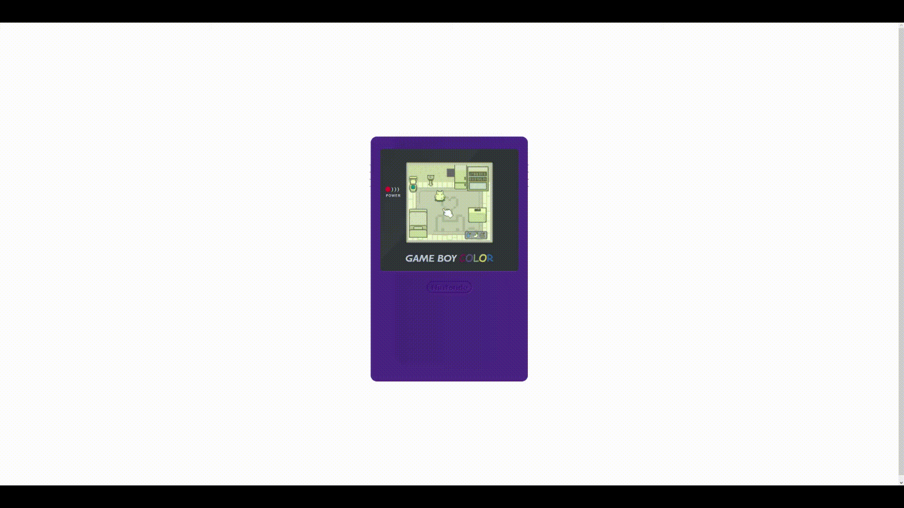

# Tamagotchi Simulation using p5.js

This is a simple Tamagotchi simulation created using the p5.js library. In this simulation, you'll be able to take care of a virtual pet by caring, and ensuring its overall well-being.

## Getting Started

1. Clone this repository to your local machine or download the ZIP file.
2. Open the `index.html` file in your web browser to start the simulation.

## Technologies Used

- [p5.js](https://p5js.org/): A JavaScript library for creative coding and visualization.

## Acknowledgments

This project is inspired by the classic Tamagotchi virtual pet toys that were popular in the 1990s.

## License

This project is licensed under the MIT License - see the [LICENSE](LICENSE) file for details.
